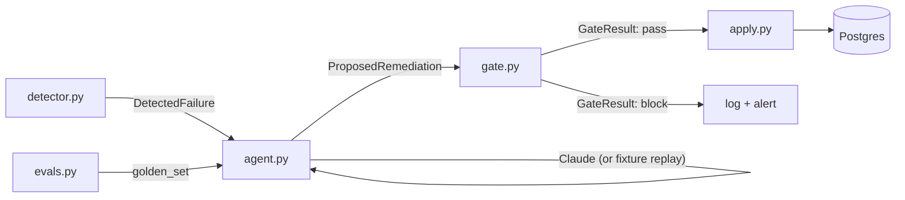

# pipeline-guardian


[](LICENSE)

Open-source reference implementation of the **"LLM proposes, deterministic code disposes"** pattern. A small ETL pipeline is seeded into one of three mutation-class failure modes. An LLM agent proposes a structured remediation. A deterministic safety gate re-validates the precondition immediately before applying — the LLM is never the final authority.

## Why It Exists

LLM agents acting on production data are dangerous if you let the model be the last check. This repo demonstrates the architecture I use to make those agents safe: **structured tool calls** so the model can't emit free-form SQL or shell, **per-tool deterministic gates** that re-validate the precondition at apply time, and **golden-set evals** that catch prompt regressions before deploy.

## Architecture



## Quick Start

```bash
git clone https://github.com/Jamil1016/pipeline-guardian
cd pipeline-guardian
docker compose up -d
pip install -e .
cp .env.example .env
python -m pipeline_guardian init-db
python -m pipeline_guardian seed-failure orphaned
python -m pipeline_guardian detect
python -m pipeline_guardian apply --failure-id 1               # dry-run (default)
python -m pipeline_guardian apply --failure-id 1 --apply       # actually mutate
python -m pipeline_guardian eval                                # golden set
```

Works **without** an `ANTHROPIC_API_KEY` — fixture replay gives identical behavior for the three seeded scenarios. With a key set, the agent calls Claude directly.

## The Three Patterns

1. **Structured tool calls.** The agent can only emit one of three remediations (`prune_orphaned`, `clear_stale_lock`, `reset_watermark`), each with a typed schema. No SQL strings. No shell.

2. **Per-tool deterministic safety gates.** Each remediation has a gate function in `gate.py` that re-validates the precondition immediately before applying. Each gate has at least one test that proves it **blocks** a bad proposal — gates without negative tests aren't gates.

3. **Golden-set evals.** `evals.py` runs the agent against `golden_set/cases.jsonl` in CI; the build fails if pass rate drops below 90%. This is what catches prompt regressions before deploy.

## Failure Modes

| Mode | What the agent must do | The gate's job |
|---|---|---|
| Orphaned baseline rows from a failed run | `prune_orphaned(run_id, expected_count)` | Verify count still matches; refuse if run no longer marked failed |
| Stuck advisory lock | `clear_stale_lock(lock_id)` | Verify lock still in the stuck-marker table |
| Stale watermark | `reset_watermark(stream_name, to_value)` | Verify `to_value` is in `[current, source_latest]` — never backward, never past source |

## Without an API Key

When `ANTHROPIC_API_KEY` is unset (or `--force-replay` is used internally), the agent reads from `pipeline_guardian/fixtures/llm_replay.jsonl`. The fixture maps each failure `kind` to a tool call template, rendering `$<key>` placeholders from the failure's signature. This is what makes the demo work for everyone and what makes CI deterministic.

## Tests

```bash
pytest                              # all tests (Docker required)
SKIP_INTEGRATION_TESTS=1 pytest     # unit only — fast
pytest --cov                        # with coverage
```

| Test file | Covers |
|---|---|
| `test_detector.py` | All three detection paths + signature hash stability |
| `test_runbook.py` | Tool schemas match Anthropic spec; tool_for() lookup |
| `test_agent_replay.py` | Fixture replay routes each kind to correct tool |
| `test_gate.py` | Each gate has PASS + at least one BLOCK test |
| `test_apply.py` | Each apply mutates exactly the expected rows |
| `test_evals.py` | Golden set runs, pass rate ≥ 90% |
| `test_cli.py` | argparse + dispatch |

## Background

I built this pattern at scale at $WORK against a private ETL system. The case study with production metrics is at:
**https://portfolio-gules-gamma-14.vercel.app/projects/pipeline-guardian**

## License

MIT
